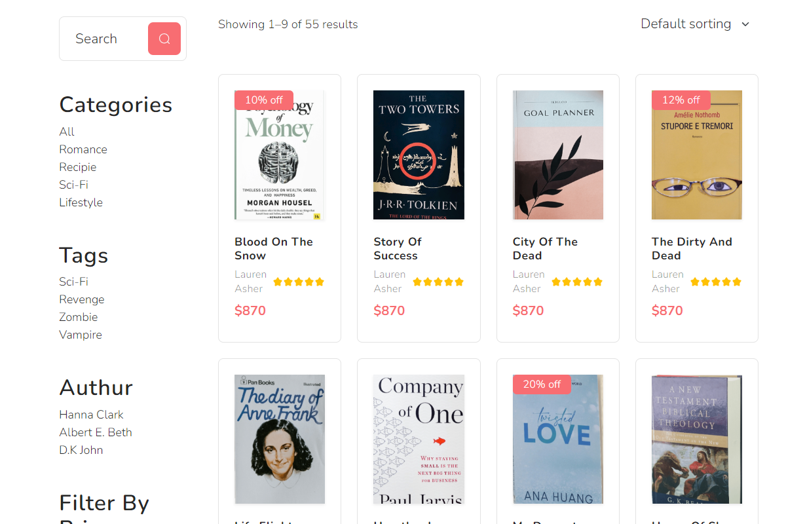

# Spring Boot course

This project is meant to teach Java fundamentals by creating a book shop, step by step.  
It uses the [Spring Boot](https://docs.spring.io/spring-boot/docs/current/reference/html/getting-started.html) framework, a [Bootstrap 5](https://getbootstrap.com) frontend and stores its data in [CSV](https://en.wikipedia.org/wiki/Comma-separated_values) files.

This is how the final shop looks like:

